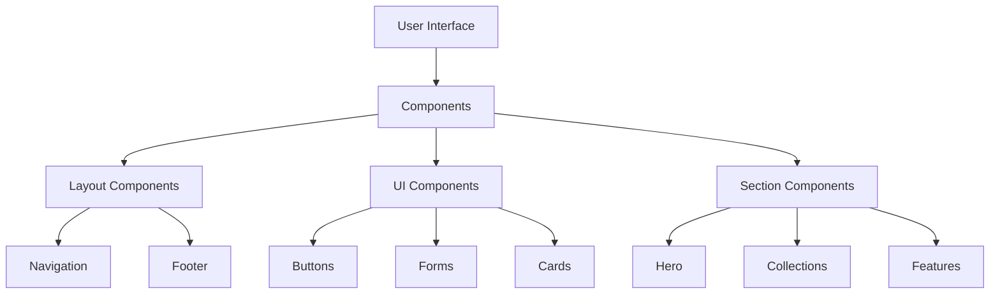
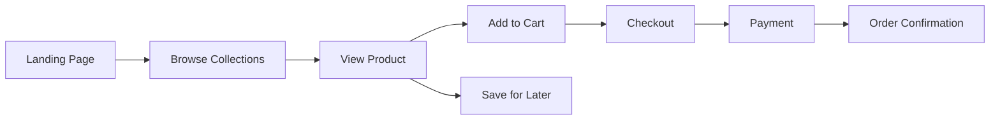
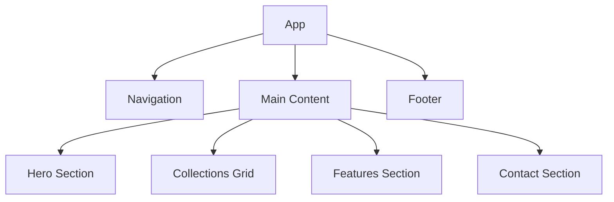
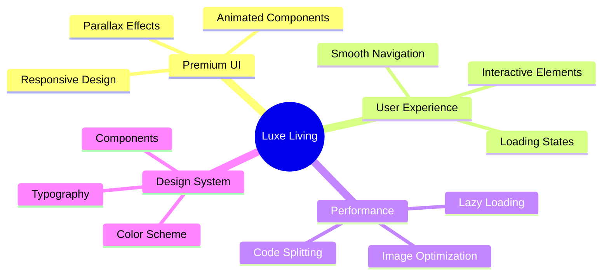
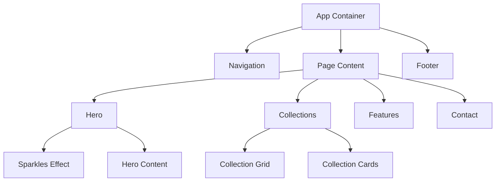
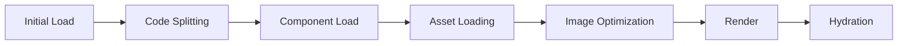

# Luxe Living - Premium Furniture E-commerce

Welcome to Luxe Living, a sophisticated furniture e-commerce platform built with modern web technologies and premium design principles.


## 🆕 Latest Features

### Navigation & UI Enhancements
- Modern dock menu with cool-toned color scheme (blues and greens)
- Glassmorphism effects with smooth animations
- Responsive design optimized for both desktop and mobile
- Premium search functionality with animated transitions
- Integrated avatar system featuring team members


### User Interface
- Enhanced hero section with team showcase
- Smooth hover effects and transitions
- Consistent branding across all pages
- Improved mobile responsiveness
- Premium navigation experience

### Brand Identity
- Unified color scheme with cool tones
- Consistent typography and spacing
- Integrated logo and branding elements
- Enhanced visual hierarchy

## Application Architecture



## User Flow



## Component Structure



## Design Philosophy

Our application embodies luxury and sophistication through:

- **Clean Typography**: Combining Playfair Display for headings and Inter for body text
- **Premium Color Palette**: Warm neutrals and sophisticated accents
- **Micro-interactions**: Subtle animations and transitions
- **Responsive Design**: Seamless experience across all devices
- **Performance**: Optimized images and smooth scrolling effects

## Features



## Technical Stack

- **Frontend Framework**: React + TypeScript
- **Styling**: Tailwind CSS
- **Animations**: Framer Motion
- **UI Components**: Shadcn UI
- **Icons**: Lucide Icons

## Project Structure

```
src/
├── components/
│   ├── layout/       # Layout components
│   ├── sections/     # Page sections
│   └── ui/           # Reusable UI components
├── styles/           # Global styles
└── utils/           # Utility functions
```

## Component Hierarchy



## Performance Optimization



## Getting Started

1. Clone the repository
2. Install dependencies: `npm install`
3. Start development server: `npm run dev`
4. Visit `http://localhost:5173`

## Design System

### Typography
- Headings: Playfair Display (Serif)
- Body: Inter (Sans-serif)

### Colors
- Primary: Warm browns and neutrals
- Accent: Subtle gold and cream tones
- Background: Clean whites and light grays

### Animations
- Scroll-based parallax effects
- Hover transitions
- Fade-in reveals
- Smooth page transitions

## Best Practices

- Mobile-first responsive design
- Optimized image loading
- Semantic HTML structure
- Accessible UI components
- Performance optimized animations

## Deployment

The application can be deployed using your preferred hosting service. For optimal performance, we recommend using a CDN for static assets and implementing proper caching strategies.

## Contributing

We welcome contributions! Please read our contributing guidelines and submit pull requests for any enhancements.

## License

This project is licensed under the MIT License - see the LICENSE file for details.
